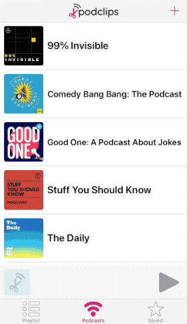
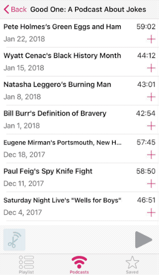
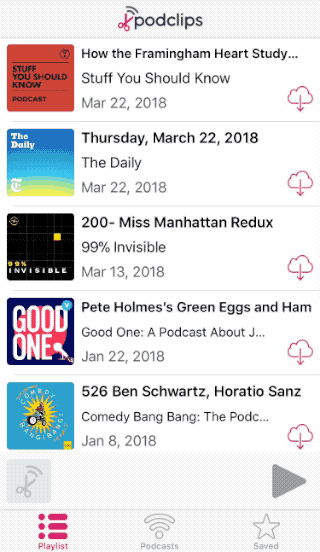

# Podclips

## Overview
Podclips is an iOS app that allows users to cut out and share clips from their favourite podcasts.

## Features

### Podcast Library

Add podcasts to your library and browse the most recent episodes.

Tap the **+** button to add an episode to your Playlist.

Tap an episode to listen. Tap the miniplayer to bring up the player.

### Bookmarks

Tap the bookmark button to create a new bookmark.

### Clips

Tap the scissors button to create a new clip. Drag the handles to adjust the length of the clip. Tap the steppers to make fine adjustments.

### Sharing

In the Saved tab, tap the share button to send a clip to a friend!

## Tech Stack

* Swift
* AV Foundation
* Core Data
* FeedKit

## Contributors
* [Ryan Maksymic](https://github.com/ryanmaksymic)
* [Yongwoo Huh](https://github.com/yongwoohuh)
